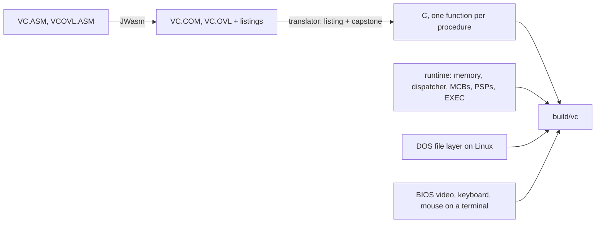

# vc-linux

**Preserving DOS software as source, not as an emulator image.**

Most DOS software survives as a binary inside an emulator, and lives only as long as that emulator
is maintained. vc-linux preserves programs a different way. Each one is kept as three things:

1. **The original source, unedited.** Volkov Commander's own assembly is in `asm/`. The other
   programs are in `third_party/`, each with its licence and the upstream commit it came from.
2. **A reproducible build of that source,** assembled or compiled the way it was originally.
3. **A machine translation to C,** made instruction by instruction and checked against a
   reference CPU (unicorn) from random states. The translated C is never edited by hand.

Only DOS and the PC hardware around the CPU are rewritten, by hand, in `runtime/`. The result is
ordinary C that any C compiler can build. Today it runs as a native Linux program on your real
files, and as WebAssembly in any browser. No emulator runs at run time.

| Preserved so far | Author, year | Licence |
|---|---|---|
| Volkov Commander 4.99.09, the file manager | Vsevolod Volkov, 1991-2000 | BSD-2 (released 2026) |
| GW-BASIC | Microsoft, 1983 | MIT (released 2020) |
| *BASIC Computer Games*, twelve of them | David H. Ahl, 1978 | public domain (2022) |
| bootLogo, a Logo with turtle graphics | Oscar Toledo G., 2024 | BSD-2 |
| Rogue 5.4.4, the original roguelike | Michael Toy, Ken Arnold, Glenn Wichman, 1980-1985 | BSD-3 |
| VZ Editor 1.6 | c.mos, Village Center, 1990s | BSD-3 |
| MS-DOS Kermit 3.15 | Columbia University, 1982-1997 | BSD-3 (released 2011) |
| MS-DOS 2.0 COMMAND.COM, EDLIN, DEBUG, FIND, MORE, SORT and FC | Microsoft, 1983 | MIT |

**Try it in your browser: [notanemulator.com](https://notanemulator.com/).** VC starts at once,
and runs MS-DOS's shell and utilities, VZ Editor, GW-BASIC, twelve classic BASIC games, bootLogo turtle graphics and Rogue
from its `H:` drive, the way DOS did. It is the same translated code, compiled to WebAssembly.

## How this differs from emulation and rewrites

| | Keeps the original program | Runs without an emulator | Works on your real files |
|---|---|---|---|
| DOSBox, dosemu2, js-dos archives | yes | no | no: a fake drive, 8.3 names |
| Midnight Commander, far2l | no: different programs | yes | yes |
| **vc-linux** | **yes: translated instruction by instruction** | **yes** | **yes, long and Cyrillic names** |

## Quick start

    curl -fLo vc https://github.com/evoleinik/vc-linux/releases/latest/download/vc-linux-x86_64
    chmod +x vc && ./vc

That is one static binary for x86-64 Linux, with no dependencies. You need a terminal of at least
80×25. Set `COLORTERM=truecolor` for the exact VGA palette.

To build from source, you need gcc, make, [uv](https://docs.astral.sh/uv/), and an
OpenWatcom 2.0 installation for the bundled 16-bit DOS C program. Set `WATCOM`
to that installation's root, or fetch the pinned version below (the 524 MB
toolchain is not in this repository):

    git clone https://github.com/evoleinik/vc-linux && cd vc-linux
    tools/fetch-openwatcom.sh build/openwatcom && export WATCOM=$PWD/build/openwatcom
    uv sync && make
    build/vc

`make rogue` builds `build/rogue/ROGUE.EXE` and its verbose link map. Project-owned
DOS shims adapt Rogue's Unix interfaces and 32-bit integer assumptions; the
vendored Rogue and PDCurses sources are never edited.

`build/vc [DIRECTORY]` opens in that directory. Settings live in `~/.config/vc-linux/` and a log
goes to `~/.cache/vc-linux/vc.log`.

## What works

| Key | Action | Notes |
|---|---|---|
| F3 | View | VC's own viewer |
| F4 | Edit | opens `$EDITOR` on Linux; VZ Editor when unset/empty, and in the browser |
| F5, F6 | Copy, rename or move | long and Cyrillic names kept |
| F7, F8 | Make directory, delete | F8 on a symlink removes only the link |
| Alt-F10, Ctrl-Z | Directory tree | scans the whole drive, so use it on `H:` |
| Ctrl-Q, Ctrl-L | Quick view, info panel | |
| Ins, Grey + − * | Select files | grey keys need application keypad mode, which vc turns on |
| Ctrl-[, Ctrl-] | Put the left or right panel's path on the command line | Ctrl-[ needs a terminal that reports keys |
| Ctrl-I, Ctrl-M | Put the selected names on the command line, then select them again | need a terminal that reports keys |
| Ctrl-H | Show or hide dotfiles | dotfiles carry the DOS hidden attribute |
| Ctrl-\\ | Go to the root of the drive | |
| Alt-letter | Speed search | takes a `*` wildcard |
| Command line | Translated DOS programs; `/bin/sh` on Linux, COMMAND.COM in the browser | Searches the current DOS directory and DOS `PATH` for `.COM`/`.EXE`; Linux keeps its host shell |
| `dos2` (Linux), `command` (browser) | Microsoft's original MS-DOS 2.0 shell | `DIR`, `TYPE`, `COPY`, `ECHO` and `.BAT` files; `EXIT` restores VC's panels |
| Enter on `.BAS` | GW-BASIC | `SYSTEM` returns to VC; Ctrl-Pause or Ctrl-Shift-B stops BASIC |
| `kermit take bbs.tak, stay` (Linux), or Enter on `H:\BBS.TAK` (browser) | Dial the BBS in MS-DOS Kermit | Ctrl-] then C returns to Kermit's prompt; `HANGUP`, then `EXIT`, returns to VC |
| `bootlogo`, or Enter on `BOOTLOGO.COM` | bootLogo turtle graphics | `QUIT`, then VC's Enter confirmation returns to the panels |
| `rogue`, or Enter on `ROGUE.EXE` | Original Rogue 5.4.4 | `h j k l` or arrows move, `?` gives help, `Q` then `y` quits, `S` saves |
| Mouse | Click to move the cursor | SGR mouse reporting |

Drives: `C:` is `/` and `H:` is your home directory. Names are shown in code page 866, so Cyrillic
displays correctly.

Type `dos2` on Linux, or `command` in the browser, for Microsoft's MS-DOS 2.0 prompt, then `dir`, `echo hello`,
`type FILE.TXT`, or `copy FILE.TXT COPY.TXT`. `exit` returns to VC. The original
EDLIN line editor, DEBUG, FIND, MORE, SORT and FC accompany it: for example,
`find "x" FILE.TXT`, `sort < FILE.TXT`, and `fc FILE.TXT COPY.TXT` at its prompt.
`debug` opens the `-` prompt; `q` quits. DEBUG can inspect files and memory,
but newly assembled or modified code has no translation to execute.

In the browser VC's ordinary command line also uses `H:\COMMAND.COM`, including
batch files. Utilities and `DOS.TXT`, a guide with three examples, live in
`H:\DOS` on DOS `PATH`. On Linux, `dos2` is the explicit DOS shell:
ordinary VC commands still use `/bin/sh`, and Linux `COMSPEC` is unchanged.
The seven DOS programs install in `$XDG_CONFIG_HOME/vc-linux/DOS2` (default
`~/.config/vc-linux/DOS2`). Only COMMAND's own environment adds that directory
to `PATH`: VC's `find`, `sort`, `more`, `fc` and `command -v git` retain their
host-shell meanings. A byte-identical `DOS2.COM` alias sits beside the other
installed programs, `DOS.TXT` and `DOSLIC.TXT` in the config directory. Exact
unchanged copies from the old flat installation are retired; edited files and
user-created symlinks stay untouched. No extra files are put directly in your
home directory. Batch files on Linux run inside `dos2`.
`make msdos2` builds the unedited vendored source with JWasm and JWlink.
[`third_party/msdos2/UPSTREAM`](third_party/msdos2/UPSTREAM) records the Microsoft
repository commit and MIT licence; the build's per-program comparison report
[`third_party/msdos2/IDENTITY.md`](third_party/msdos2/IDENTITY.md) records where
the sources postdate or differ from Microsoft's shipped binaries.

Type `gwbasic` to run the original 1983 interpreter, translated ahead of time just like VC.
Try `PRINT 2+2`, then `SYSTEM`. The installed `GWBASIC.EXE` is a real DOS file: EXEC reads it
and selects a translation by its complete bytes, not its name. Renamed copies work. Direct DOS
EXEC rejects changed or untranslated executables; typed commands fall back to the Linux shell.
The shipped association's `gwbasic` command never falls back, so a BASIC file name cannot become
shell syntax when the interpreter is missing or changed. VC.COM and VC.OVL are internal parts
of VC: they always use their built-in translations, independently of the installed files.
Linux installs the interpreter in the config directory; bring your own `.bas` files. Linux sound
stays silent. A `CALL` or `USR` into code without a translation stops that BASIC session with a
short message and returns to VC.

F4 opens the selected file in VZ Editor 1.6 (US), another translated DOS program. On Linux,
a nonempty `$EDITOR` still takes precedence and receives the resolved host path as one argument.
Otherwise VZ receives an absolute DOS short name, pinned to the selected pathname until the editor
exits even if neighboring names change or another program replaces the file. VZ refuses file
paths longer than its 63-byte absolute-path limit and current directories whose short path plus
13 bytes reaches 64; each VZ child gets a private short temporary directory for its swap files.
Type `vz NEW.TXT` to create a file. Use the arrows to move, Alt-S (or Esc then S)
to save, Enter to accept the name, and Alt-Q (or Esc then Q), then Y, to quit. F1 opens the English
file menu; F12 shows help. The defaults write DOS CRLF lines and a final Ctrl-Z byte. The installed
`VZ.DEF` enables backups (`Eb+`): saving keeps the previous contents in `.BAK`, including when a
write fails partway. Restore that backup if a save fails. An unchanged earlier `Eb-` default is
upgraded; customized definitions and symlinks are preserved, so check their Backup File option.
`make vz` reproduces the shipped 55,856-byte `VZUS.COM` exactly without changing vendor sources.
`VZ.COM` and its English `.DEF` files install beside GW-BASIC; EXEC still matches complete bytes.

Type `bootlogo` for Oscar Toledo G.'s original bootLogo. Try `REPEAT 4 [REPEAT 4 [FD 20 RT 90] RT 90]`
or `REPEAT 36 [FD 60 RT 170]`. `QUIT` exits; VC's own DOS code then asks for Enter and restores
its text panels. `BOOTLOGO.COM` is a real, 503-byte NASM-built COM file installed next to GW-BASIC.
Renamed copies run by the same byte-matching EXEC rule. The `logo` command remains available
for a host program such as UCBLogo.

Type `rogue` for the original dungeon game, compiled with OpenWatcom to a real
large-model 8086 DOS EXE and then translated ahead of time. There is no native
Rogue port running behind that command. `y u b n` move diagonally, `i` shows
inventory, `,` picks up an item, and `?` explains the other keys. `S`, then `y`,
saves to `rogue.sav`; the next plain `rogue` restores it. Saves and `rogue.scr`
scores live in the current DOS directory, not beside the installed executable.
If automatic restore rejects a save, it is renamed to `rogue.bad` and a new
game starts with a notice. An existing `rogue.bad` is never overwritten.
The player name is fixed to Rogue, shell escape and Unix signals are disabled,
and successful restore consumes the save, as in the original game.

CGA modes 4/5 (320×200, four colours) and 6 (640×200, two colours) use real interlaced B800h
video memory. GW-BASIC's `SCREEN 1`, `PSET`, `LINE`, `CIRCLE` and `DRAW` work; `SCREEN 0`
returns BASIC to text. Terminals display an 80×25 coloured braille reduction; a browser shows
the exact pixels on a crisp canvas. The original BASIC has only 31 bytes of typeahead, so type
long statements normally rather than pasting a whole line at once. bootLogo is deliberately
tiny: always close brackets, keep procedure definitions under 120 characters, and avoid zero
distances or repeat counts (which mean 65536).

In the browser, select `H:\BBS.TAK` and press Enter to dial the notanemulator BBS
with the original MS-DOS Kermit 3.15. Its own script sets COM1 to 57600 baud and selects `ANSI-BBS`,
Kermit's terminal mode with PC colours, transparent eight-bit characters and CP437.
The association runs `kermit stay, take BBS.TAK`: Kermit's command-line `STAY`
keeps its prompt open after you leave the terminal. The selected filename is
passed as a pinned DOS short path, so commas cannot become Kermit commands.
The virtual Hayes modem answers `ATDT555-1992` with `CONNECT 14400` and carries
telnet data at about 14400 bits per second. Telnet negotiation is handled by the
modem, not by a modified Kermit. The browser connects on dial to
`wss://axis.tail85247.ts.net:8443/`; the page remains a static site.

Linux deliberately has **no default TCP endpoint**. Start it with
`VC_MODEM_555_1992=host:port build/vc` to connect to a telnet BBS you can reach.
Then type `kermit take bbs.tak, stay` on VC's command line, from any directory.
Kermit's own `TAKE` searches the current directory and then DOS `PATH`; `STAY`
keeps its prompt open after you leave the terminal. No init-file workaround or
Kermit source change is needed.
An unset endpoint, an unknown number, or an unavailable server produces `NO ANSWER`.
`BBS.TAK` and `KERMIT.TXT` install beside `KERMIT.EXE` and the other files in
`$XDG_CONFIG_HOME/vc-linux` (default `~/.config/vc-linux`), on DOS `PATH`.
Existing scripts and guides in that config directory are preserved. VC does not
create, update, move or delete copies directly in your real home directory;
any files left there by an earlier version remain untouched.
`make kermit` rebuilds the pure-assembly executable with `no_network` defined on
the assembler command line; vendor sources remain unedited. The source and
licensing provenance, including both archive hashes, are in
[`third_party/mskermit/UPSTREAM`](third_party/mskermit/UPSTREAM).

In Kermit's terminal, Ctrl-] followed by C returns to `MS-Kermit>` without hanging
up. `CONNECT` resumes; `HANGUP` drops DTR; `EXIT` or `QUIT` returns to VC's panels.
To use Hayes commands directly, leave a one-second typing gap, type `+++`, then
wait another second for `OK`. Type `ATH` and Enter for `NO CARRIER`; `ATO` instead
resumes the existing call. A disconnected server also produces `NO CARRIER`.
`KERMIT.TXT` keeps these instructions beside the script: in the config directory
on Linux, and at `H:\KERMIT.TXT` in the browser.

In a plain terminal, Ctrl-[ sends the same byte as Esc. Ctrl-I sends the same byte as Tab, and
Ctrl-M the same as Enter. VC gives each of them a different job, so vc asks the terminal to report
keys in full. kitty, foot, Ghostty, Alacritty and iTerm2 do it through the kitty keyboard protocol.
WezTerm does too once `enable_kitty_keyboard` is on. xterm does it through modifyOtherKeys.

## In your browser

The same translated C also compiles to WebAssembly with Emscripten. The page opens VC at once on a
small in-memory `H:` drive holding a README, VC's history, its own assembly sources, VZ Editor,
GW-BASIC, bootLogo, Rogue, Microsoft's DOS shell and utilities, and twelve of David Ahl's
public-domain BASIC Computer Games. xterm.js
shows the screen in the IBM VGA font. The page reports keys in full, so Ctrl-[, Ctrl-I and Ctrl-M
work, and holding Shift, Ctrl or Alt swaps the key bar. Files vanish on reload.
The command line runs Microsoft's COMMAND.COM, including `dir`, `type`, `copy`,
`echo` and `.BAT` files. `command` opens its prompt and `exit` returns to VC.
F4 edits with VZ. Open `GAMES` and
press Enter on a `.BAS` file to play. `BEEP`, `SOUND` and `PLAY` use a Web Audio square wave after
the first key press. Use Ctrl-Pause or Ctrl-Shift-B to stop a game, then `SYSTEM` to return to VC.
`BOOTLOGO.TXT` explains bootLogo with a square, a star and the original README's flower. The original
`GAMES\SPIRAL.BAS` example uses BASIC's `SCREEN 1` and `DRAW`; press a key when it finishes to
return to text. The CGA canvas occupies the same screen area as xterm and keeps its keyboard
input active.
`H:\GAMES\ROGUE.EXE` is also on the DOS `PATH`: type `rogue` from either panel
directory, or press Enter on that EXE. Its saves, like all browser files, vanish
on reload.

The Source button, or Ctrl-Shift-F12, shows the original assembly behind the running code. It
shows the line the CPU is on, with Volkov's comments and the lines around it. Below that are the
callers that led there, found from real return addresses on the stack, and the last 32 lines that
ran. It works for VC, GW-BASIC, bootLogo and VZ. For Rogue, compiled from C, it names the function.
The sources load the first time the panel opens.

The page first downloads VC alone, about 1.3 MB gzipped. Each translated program is a separate
wasm module, fetched the first time DOS runs it and kept for the session. On a phone held upright,
a key pad appears under the screen with F1 to F10, arrows, Esc, Tab, Ins, Enter, sticky Ctrl, Alt
and Shift, and a button that opens the phone's keyboard. The page text follows the browser's
language in English, Russian or Ukrainian, and `H:\ПРОЧТИ.TXT` is the README in Russian.

To build it, put Emscripten on your PATH (`source emsdk_env.sh`), then:

    make web          # build/web/: index.html, vc.mjs, vc.wasm and one wasm per program
    make test-web     # Node checks VC, DOS shell/utilities, editors, games, Kermit, graphics and sound

Serve `build/web/` over HTTP to open it. The design is in `docs/plans/2026-10-01-browser-build.md`.

## Why shouldn't I use it?

- **It is VC 4.99.09, an alpha from 2000.** Its own editor is switched off in the source. Some
  menus point at DOS things that do not exist here, such as EMS memory and archivers.
- **DOS limits stay.** A command line holds 126 bytes, and vc refuses a longer one rather than run
  a truncated command. Characters with no code page 866 form, the characters DOS forbids in names
  (`\ / : * ? " < > |`) and trailing spaces or dots cannot be spelled in DOS. Those names show as
  `name■~1A2B.txt`, with a stable suffix that always reaches the right file.
- **The screen is 80×25.** It does not resize with your terminal.
- **Ctrl-O shows VC's own screen.** It does not show what your last shell command printed.
- **Holding Shift, Ctrl or Alt changes the key bar** only on terminals that speak the kitty
  keyboard protocol. Elsewhere, Ctrl-[, Ctrl-I and Ctrl-M act as Esc, Tab and Enter.
- **Only Linux on x86-64 is tested.**

## How it works

- **The translator** (`translator/`) reads JWasm or NASM instruction boundaries from the assembler listing and
  decodes the linked bytes with capstone. It emits C for each instruction, flags included. It
  also decodes bytes the CPU runs that the listing calls data. VC starts by executing the text
  `RESIDENT`.
  bootLogo's single mutable pen-colour operand is read from live memory. VZ's macro interrupt
  slot has two source-proved forms, selected and checked against live bytes. Four indirect
  `DRAW` entries are emitted in a separate, source-proved supplement; VC's and GW-BASIC's
  original generated C stay byte-identical.
  For compiled C, it reads the verbose Watcom link map, checks every linked
  object's initialized bytes and relocations (C library members included), and
  checks WDIS instruction boundaries against Capstone before emitting C. JWasm
  cannot preserve all Watcom instruction encodings when reassembling symbolic
  disassembly; the verified map-driven path avoids changing the DOS executable.
- **The runtime** (`runtime/rt.c`, `runtime/dos_core.c`) keeps the machine faithful: a 1 MB
  memory array, a real stack, a real interrupt vector table, MCB chain and PSPs. VC's tricks run
  as written. It runs VC.OVL as a child process, splits its own memory block, and copies its
  resident code elsewhere. The dispatcher finds that copied code by its bytes.
- **The DOS file layer** (`runtime/dos_fs.c`) maps INT 21h file calls, including the 71xxh
  long-name family, to Linux.
- **The BIOS layer** (`runtime/bios.c`, `runtime/term.c`) draws video memory to the terminal as
  ANSI output, and feeds terminal input into the BIOS keyboard buffer.

The full design and every decision are in `docs/plans/2026-09-30-native-port.md`.

## Tests

    make test

| Suite | What it proves |
|---|---|
| `test-translator` | Every distinct instruction in VC, GW-BASIC, bootLogo, Rogue, VZ and Kermit matches Unicorn from 32 random states each. One whole routine matches the original on all 131,072 inputs. |
| `test-rogue-build` | The original Rogue/PDCurses DOS build, linked runtime licence and reproducible EXE bytes. |
| `test-vz-build` | Exact shipped US COM bytes, reproducible map/listings, and the build-time MASM compatibility layer. |
| `test-fs` | The DOS file layer, DOS 1.x FCB calls, and per-process short-path leases: over 4,400 checks against a temporary tree. |
| `test-exec` | Byte-identical EXEC, DOS search order, command tails, safe F4/associations, VZ path/temp limits and child cleanup. |
| `test-machine` | Timer interrupts, IF, HLT, Ctrl-Break, PIT speaker frequencies and declared mutable operands. |
| `test-kermit-build` | Unedited, licensed Kermit sources, a reproducible pure-assembly EXE and complete linked listings. |
| `test-msdos2-build` | Unedited Microsoft sources, reproducible COMMAND.COM and six utilities, and per-program shipped-binary comparisons. |
| `test-modem`, `test-serial-machine` | UART registers, DLAB, real IRQ 4/8259 EOI, INT 14h, Hayes commands, guard timing, 14400-bps pacing and exact telnet replies to the captured BBS. |
| `test-modem-transport` | Real nonblocking TCP on loopback, including failure and disconnect behavior. |
| `test-embed` | Exact native/web DOS-file round trips, VC image deduplication, and bounded startup decompression with corruption checks. |
| `test-process` | Child fault recovery, parent interrupt/device state, and fatal no-translation faults in VC itself. |
| `test-term` | Key parsing, the screen renderer, and BIOS video, keyboard and mouse: about 5,600 checks. |
| `test-cga` | Every CGA mode and pixel address, palette, XOR/readback, graphics glyphs, cursor and scrolling: over 823,000 checks. |
| `test-ini` | The shipped `VC.INI` passes VC's own checksum and suits Linux. |
| `test-web` | The WebAssembly build under Node: VC, COMMAND.COM DIR/batch commands and all seven lazy DOS modules, VZ F4/edit/save/quit with MEMFS readback, Rogue play/save/restore, GW-BASIC, bootLogo, Kermit BBS dial/type/hangup/EXIT, exact CGA pixels, canvas transitions and sound. Needs Emscripten. |
| `test-e2e` | VC in a pseudo-terminal: file operations and keys, real DOS launches, identity/injection checks, VZ editing and backups, Rogue play/save/restore, Kermit's full BBS workflow, Ctrl-Break, every shipped BASIC game's first prompt, Logo drawings and BASIC graphics. |

Every finding from the three code reviews was fixed with a test that failed on the old code first.

The Kermit e2e tests replay `tests/fixtures/enigma-connect-2026-10-02.bin` using a
local TCP BBS and an injected binary WebSocket in Node; neither contacts the live
server. Restricted environments that deny `socket()` cannot run the TCP gate.
Supplemental native syscall and pipe-transport tests exercise the same modem and
translated Kermit without network access, but do not count as the TCP gate.

The browser keeps the same 1.3 MB first-load limit. Startup reconstructs VC's
files from its linked image bytes and losslessly unpacks the other DOS files
with a bounded, fixed-profile decoder. Checksums and byte-for-byte tests cover
this packaging; every file is complete before DOS starts, without another fetch.

## Debugging

- `VC_TRACE=1 build/vc` logs every INT 21h call with its string argument and result.
- `kill -USR1 <pid>` logs the registers and the last 256 addresses the dispatcher ran.
- `VC_SCREEN_DUMP=file` writes video memory as text after every render.
  In CGA modes it writes the 80×25 braille drawing.
- `VC_FRAME_DUMP=file` writes exact pixels as a binary P5 PGM: 320×200 with maximum 3 (modes
  4/5), or 640×200 with maximum 1 (mode 6). Bytes are raw CGA palette indices, not converted
  brightness. Returning to text leaves the last graphics frame available for inspection.

## Layout

- `asm/` VC 4.99.09 sources by Vsevolod V. Volkov, BSD-2, from the
  [ddanila/vc](https://github.com/ddanila/vc) build branch.
- `translator/` Python: JWasm/NASM listing plus linked image to C.
- `runtime/` C: machine state, dispatcher, loader, DOS and BIOS services, terminal.
- `data/` default `VC.INI` (written by VC itself), `VCEDIT.EXT`, `VC.HLP`.
- `web/` the browser page, its H: README, and vendored xterm.js and IBM VGA font with their
  licences.
- `tools/` JWasm, `vcini.py` (edit VC.INI safely), `snapshot.py` (screen to HTML),
  `social_preview.py`.
- `tests/` all suites. `tests/spike_puttime/` is the first proof that translation works.
- `docs/` the plan and the work briefs that built this.

## History

Vsevolod Volkov wrote VC as a student at Kyiv Polytechnic, where he studied electronics. It first
appeared in the Softpanorama Bulletin, a monthly magazine on floppy disks, in December 1992. It
came as a New Year gift to readers. A stable beta had circulated for about six months before
that. In May 2026 Volkov told Danila Sukharev how it began:

> Initially, the program was conceived simply as a joke: a tiny assembler program that looked
> like NC 3.0, whose only function was to list directory contents. Then, in my spare time, I
> added individual functions: copying, viewing, and so on. After a while, I had something usable.
> Moreover, on those PC/XT-class computers, the program ran significantly faster and took up less
> precious RAM. I began developing it for my own use. Other users noticed the program, and it
> began to spread around the world. Back then, it didn't have its own name. Users came up with the
> name Volkov Commander.

VC 4 fits in one COM file under 64 KB. It added keys that later file managers copied. Ctrl-[ and
Ctrl-] put a panel's path on the command line. Ctrl-I puts the selected names there. Nikolai
Bezroukov, who ran Softpanorama, tells the story in
[Volkov Commander: a masterpiece of assembler programming](https://softpanorama.org/OFM/Paradigm/Ch03/volkov_commander.shtml).

## Citing and archives

Each release is archived on Zenodo. The DOI
[10.5281/zenodo.23085585](https://doi.org/10.5281/zenodo.23085585) always resolves to the latest
release. `CITATION.cff` gives the full citation, and GitHub's "Cite this repository" button reads
it. Software Heritage also keeps the full git history, at
[archive.softwareheritage.org](https://archive.softwareheritage.org/browse/origin/?origin_url=https://github.com/evoleinik/vc-linux).

## Credits and license

Volkov Commander is by Vsevolod V. Volkov, who released the sources under the BSD 2-Clause
license in 2026 (`asm/LICENSE.TXT`). Danila Sukharev preserved them and made them build with
JWasm in [ddanila/vc](https://github.com/ddanila/vc). JWasm is by Andreas Grech and others, under
the Sybase Open Watcom Public License (`tools/jwasm/README.md`).

GW-BASIC is Microsoft's MIT-licensed 1983 source with the OEM work from TK Chia's fork
(`third_party/gwbasic`). Its pinned version is in `UPSTREAM`. David Ahl placed his works in the
public domain in 2022; the game listings are vendored from `coding-horror/basic-computer-games`.
Build-time conversion changes DOS names and line endings; Star Trek additionally gets spaces
around compact `TO`/`STEP` keywords for this interpreter's tokenizer. Vendored listings stay
unchanged. The first-prompt gate is not a claim that every later branch of a game was tested.

bootLogo is Oscar Toledo G.'s BSD-2-CLAUSE Logo (`third_party/bootlogo`); NASM 3.02 builds its
unchanged COM source (`tools/nasm`). Graphics text uses Daniel Hepper's public-domain 8×8 fonts
(`third_party/font8x8`). The shared CP437/866 box and block characters have glyphs; other
unsupported non-ASCII graphics characters remain blank. `web/GAMES/SPIRAL.BAS` is an original
example under this repository's BSD-2 license, separate from Ahl's public-domain games.

Rogue 5.4.4 is by Michael Toy, Ken Arnold and Glenn Wichman, with Nicholas
Kisseberth's portable save and platform code (BSD-3-Clause; `third_party/rogue`).
PDCurses is public domain (`third_party/pdcurses`). OpenWatcom's linked C runtime
uses the Sybase Open Watcom Public License. `ROGUELIC.TXT`, `PDCLIC.TXT`, and
`OWLIC.TXT` accompany the installed game and its browser copy.

VZ Editor 1.6 is by c.mos (Village Center), BSD-3-Clause (`third_party/vzeditor/LICENSE`).
The pinned US executable is reproduced byte-for-byte, with its original English definitions
installed alongside it except for the backup-enabled `VZ.DEF` default described above.
The browser drive includes its licence as `VZLIC.TXT`.

MS-DOS 2.0's COMMAND.COM, EDLIN, DEBUG, FIND, MORE, SORT and FC are Microsoft
source releases under the MIT licence (`third_party/msdos2/LICENSE`). Their
source-built DOS files are translated independently and lazily loaded in the
browser; `H:\DOS\DOSLIC.TXT` carries the licence there. A program-specific SETVER
table reports DOS 2.0 to these seven images without changing other programs.

The translator, runtime and tests are BSD 2-Clause (`LICENSE`). They were built with Claude Code
and OpenAI Codex.
