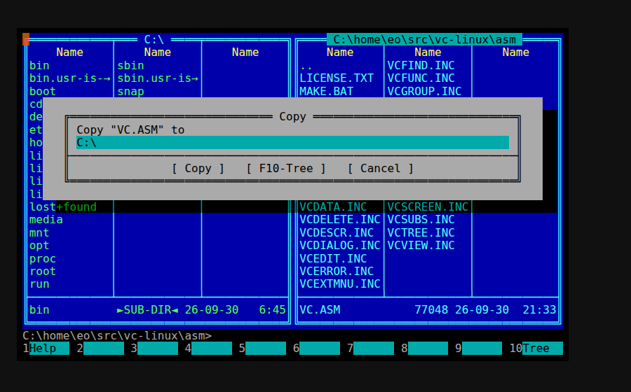

# vc-linux

Volkov Commander 4.99.09, the DOS file manager, running natively on Linux. Its original 8086
assembly is translated to C by machine. The DOS and BIOS services it calls are reimplemented in C
on top of Linux. No emulator runs at run time.

Design and decisions: `docs/plans/2026-09-30-native-port.md`.

## Run it

    uv sync && make
    build/vc [DIRECTORY]

It needs a terminal of at least 80x25. For the exact VGA colours, set `COLORTERM=truecolor`.
Settings live in `~/.config/vc-linux/` and a log goes to `~/.cache/vc-linux/vc.log`.

What works: both panels on real files with long and Cyrillic names, view (F3), edit (F4, opens
`$EDITOR`), copy (F5), rename and move (F6), make directory (F7), delete (F8), menus and dialogs,
the mouse, and commands typed on VC's command line. Those run in `/bin/sh` with the terminal
handed back, and `cd` changes VC's directory the way `COMMAND.COM` did.

VC 4.99.09's own editor is switched off in its source, so F4 uses `VCEDIT.EXT`, which maps every
file to the internal `vc-edit` command. That command hands the file name to `$EDITOR` as a single
argument, never through a shell.

**Careful with your own `VC.EXT` or `VCEDIT.EXT` entries.** VC pastes the file name in place of
`!.!` and the line runs through `/bin/sh`, so a file named `$(rm -rf ~).zip` would run that
command. The shipped `VC.EXT` is empty for that reason.

Drive `C:` is `/`. Names are shown in code page 866.

## Build and test

    uv sync            # Python tools: capstone, unicorn, pytest, pyte
    make images        # assemble VC.COM and VC.OVL from asm/ with JWasm
    make gen           # translate both to C in build/gen/
    make               # build build/vc
    make test          # every suite below

| Suite | What it proves |
|---|---|
| `make test-translator` | All 43,137 distinct instructions match unicorn from 32 random states each. `PutTime` matches the original on all 131,072 inputs. |
| `make test-fs` | The DOS file layer, register by register, against a temporary tree. |
| `make test-term` | Key parsing, the screen renderer, BIOS video, keyboard and mouse. |
| `make test-ini` | The shipped `VC.INI` passes VC's checksum and suits Linux. |
| `make test-e2e` | `build/vc` in a pseudo-terminal: the terminal shows exactly what is in video memory, and view, mkdir, copy, rename, delete and shell commands work on disk. |

## How it works

- `translator/` reads the JWasm listing for instruction boundaries. It decodes the linked bytes
  with capstone and emits one C statement group per instruction, flags included.
- `runtime/rt.c` is the dispatcher. Translated code runs until a transfer it cannot follow
  statically. The dispatcher then finds the image at CS:IP, or a C interrupt handler stub.
  Code VC copied elsewhere is matched by its bytes.
- `runtime/dos_core.c` holds the MCB chain, PSPs, EXEC and terminate. VC's own tricks run as
  written: splitting its MCB, popping its return address, running `VC.OVL` as a child.
- `runtime/dos_fs.c` maps INT 21h file calls, including the 71xxh long-name family, to Linux.
- `runtime/bios.c` and `runtime/term.c` handle video memory to ANSI output, and terminal input
  to the BIOS keyboard buffer and mouse.

## Layout

- `asm/` VC 4.99.09 sources, BSD-2 by Vsevolod V. Volkov, from the ddanila/vc build branch.
- `translator/` Python: JWasm listing + linked image to C.
- `runtime/` C: machine state, dispatcher, loader, DOS and BIOS services, terminal.
- `data/` default `VC.INI` (written by VC itself), `VC.EXT`, `VC.HLP`.
- `tools/` JWasm, `embed.py`, `vcini.py` (edit VC.INI safely), `snapshot.py` (screen to HTML).
- `tests/` all suites. `tests/spike_puttime/` is the first proof.

## Debugging

- `VC_TRACE=1 build/vc` logs every INT 21h call with its string argument and result.
- `kill -USR1 <pid>` logs the registers and the last 256 addresses the dispatcher ran.
- `VC_SCREEN_DUMP=file` writes video memory as text after every render.
- A fatal error prints the registers, stack and code bytes, and exits 70.

## Notes for AI agents

- `runtime/cpu.h`, `runtime/image.h` and `runtime/hle.h` are the contracts between the translator,
  the runtime and the DOS/BIOS layer. Change them deliberately, never in passing.
- Never trust a translation without the unicorn gate.
- DOS paths are limited to about 126 characters on a command line. Tests use short temporary
  paths for that reason.
- Change `data/VC.INI` with `tools/vcini.py` or by saving from VC (Shift-F9). A bad checksum makes
  VC ignore the whole file.
- Use `.venv/bin/python`, never a global pip.
