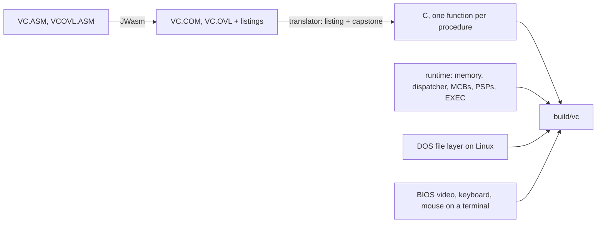

# vc-linux

**Volkov Commander, the DOS file manager, running natively on Linux.**

Volkov Commander was the fast, tiny Norton Commander clone that half of the 1990s ran on DOS. Its
author released the source under BSD-2 in 2026. This project turns that 8086 assembly into C by
machine, then reimplements the DOS and BIOS services it calls on top of Linux. The binary that
comes out is native x86-64 code. No emulator runs at run time. You manage real Linux files with
the real VC: the same keys, colours, dialogs and quirks.

## Why not DOSBox, mc or far2l?

| | Runs the original VC code | Works on your real files | Native, no emulator |
|---|---|---|---|
| DOSBox, dosemu2, js-dos | yes | no: a fake drive, 8.3 names | no |
| Midnight Commander, far2l | no: different programs | yes | yes |
| **vc-linux** | **yes: translated instruction by instruction** | **yes, long and Cyrillic names** | **yes** |

## Quick start

    curl -fLo vc https://github.com/evoleinik/vc-linux/releases/latest/download/vc-linux-x86_64
    chmod +x vc && ./vc

That is one static binary for x86-64 Linux, with no dependencies. You need a terminal of at least
80×25. Set `COLORTERM=truecolor` for the exact VGA palette.

To build from source, you need gcc, make and [uv](https://docs.astral.sh/uv/):

    git clone https://github.com/evoleinik/vc-linux && cd vc-linux
    uv sync && make
    build/vc

`build/vc [DIRECTORY]` opens in that directory. Settings live in `~/.config/vc-linux/` and a log
goes to `~/.cache/vc-linux/vc.log`.

## What works

| Key | Action | Notes |
|---|---|---|
| F3 | View | VC's own viewer |
| F4 | Edit | opens `$EDITOR` (VC 4.99.09's own editor is disabled in its source) |
| F5, F6 | Copy, rename or move | long and Cyrillic names kept |
| F7, F8 | Make directory, delete | F8 on a symlink removes only the link |
| Alt-F10, Ctrl-Z | Directory tree | scans the whole drive, so use it on `H:` |
| Ctrl-Q, Ctrl-L | Quick view, info panel | |
| Ins, Grey + − * | Select files | grey keys need application keypad mode, which vc turns on |
| Ctrl-[, Ctrl-] | Put the left or right panel's path on the command line | Ctrl-[ needs a terminal that reports keys |
| Ctrl-I, Ctrl-M | Put the selected names on the command line, then select them again | need a terminal that reports keys |
| Ctrl-H | Show or hide dotfiles | dotfiles carry the DOS hidden attribute |
| Ctrl-\\ | Go to the root of the drive | |
| Alt-letter | Speed search | takes a `*` wildcard |
| Command line | Runs in `/bin/sh` | `cd` moves VC's panel like `COMMAND.COM` did; `cd ~` works |
| Mouse | Click to move the cursor | SGR mouse reporting |

Drives: `C:` is `/` and `H:` is your home directory. Names are shown in code page 866, so Cyrillic
displays correctly.

In a plain terminal, Ctrl-[ sends the same byte as Esc. Ctrl-I sends the same byte as Tab, and
Ctrl-M the same as Enter. VC gives each of them a different job, so vc asks the terminal to report
keys in full. kitty, foot, Ghostty, Alacritty and iTerm2 do it through the kitty keyboard protocol.
WezTerm does too once `enable_kitty_keyboard` is on. xterm does it through modifyOtherKeys.

## Why shouldn't I use it?

- **It is VC 4.99.09, an alpha from 2000.** Its own editor is switched off in the source. Some
  menus point at DOS things that do not exist here, such as EMS memory and archivers.
- **DOS limits stay.** A command line holds 126 bytes, and vc refuses a longer one rather than run
  a truncated command. Characters with no code page 866 form, the characters DOS forbids in names
  (`\ / : * ? " < > |`) and trailing spaces or dots cannot be spelled in DOS. Those names show as
  `name■~1A2B.txt`, with a stable suffix that always reaches the right file.
- **The screen is 80×25.** It does not resize with your terminal.
- **Ctrl-O shows VC's own screen.** It does not show what your last shell command printed.
- **Holding Shift, Ctrl or Alt changes the key bar** only on terminals that speak the kitty
  keyboard protocol. Elsewhere, Ctrl-[, Ctrl-I and Ctrl-M act as Esc, Tab and Enter.
- **Only Linux on x86-64 is tested.**

## How it works

- **The translator** (`translator/`) reads instruction boundaries from the assembler listing and
  decodes the linked bytes with capstone. It emits C for each instruction, flags included. It
  also decodes bytes the CPU runs that the listing calls data. VC starts by executing the text
  `RESIDENT`.
- **The runtime** (`runtime/rt.c`, `runtime/dos_core.c`) keeps the machine faithful: a 1 MB
  memory array, a real stack, a real interrupt vector table, MCB chain and PSPs. VC's tricks run
  as written. It runs VC.OVL as a child process, splits its own memory block, and copies its
  resident code elsewhere. The dispatcher finds that copied code by its bytes.
- **The DOS file layer** (`runtime/dos_fs.c`) maps INT 21h file calls, including the 71xxh
  long-name family, to Linux.
- **The BIOS layer** (`runtime/bios.c`, `runtime/term.c`) draws video memory to the terminal as
  ANSI output, and feeds terminal input into the BIOS keyboard buffer.

The full design and every decision are in `docs/plans/2026-09-30-native-port.md`.

## Tests

    make test

| Suite | What it proves |
|---|---|
| `test-translator` | All 43,000 distinct instructions in both programs match the unicorn CPU emulator from 32 random states each. One whole routine matches the original on all 131,072 inputs. |
| `test-fs` | The DOS file layer, register by register: about 4,100 checks against a temporary tree. |
| `test-term` | Key parsing, the screen renderer, and BIOS video, keyboard and mouse: about 5,600 checks. |
| `test-ini` | The shipped `VC.INI` passes VC's own checksum and suits Linux. |
| `test-e2e` | `build/vc` in a pseudo-terminal: the terminal shows exactly what is in video memory, and view, copy, rename, delete, F4, the mouse, shell commands and VC's own Ctrl keys work. |

Every finding from the three code reviews was fixed with a test that failed on the old code first.

## Debugging

- `VC_TRACE=1 build/vc` logs every INT 21h call with its string argument and result.
- `kill -USR1 <pid>` logs the registers and the last 256 addresses the dispatcher ran.
- `VC_SCREEN_DUMP=file` writes video memory as text after every render.

## Layout

- `asm/` VC 4.99.09 sources by Vsevolod V. Volkov, BSD-2, from the
  [ddanila/vc](https://github.com/ddanila/vc) build branch.
- `translator/` Python: JWasm listing plus linked image to C.
- `runtime/` C: machine state, dispatcher, loader, DOS and BIOS services, terminal.
- `data/` default `VC.INI` (written by VC itself), `VCEDIT.EXT`, `VC.HLP`.
- `tools/` JWasm, `vcini.py` (edit VC.INI safely), `snapshot.py` (screen to HTML),
  `social_preview.py`.
- `tests/` all suites. `tests/spike_puttime/` is the first proof that translation works.
- `docs/` the plan and the work briefs that built this.

## History

Vsevolod Volkov wrote VC as a student at Kyiv Polytechnic, where he studied electronics. It first
appeared in the Softpanorama Bulletin, a monthly magazine on floppy disks, in December 1992. It
came as a New Year gift to readers. A stable beta had circulated for about six months before
that. In May 2026 Volkov told Danila Sukharev how it began:

> Initially, the program was conceived simply as a joke: a tiny assembler program that looked
> like NC 3.0, whose only function was to list directory contents. Then, in my spare time, I
> added individual functions: copying, viewing, and so on. After a while, I had something usable.
> Moreover, on those PC/XT-class computers, the program ran significantly faster and took up less
> precious RAM. I began developing it for my own use. Other users noticed the program, and it
> began to spread around the world. Back then, it didn't have its own name. Users came up with the
> name Volkov Commander.

VC 4 fits in one COM file under 64 KB. It added keys that later file managers copied. Ctrl-[ and
Ctrl-] put a panel's path on the command line. Ctrl-I puts the selected names there. Nikolai
Bezroukov, who ran Softpanorama, tells the story in
[Volkov Commander: a masterpiece of assembler programming](https://softpanorama.org/OFM/Paradigm/Ch03/volkov_commander.shtml).

## Credits and license

Volkov Commander is by Vsevolod V. Volkov, who released the sources under the BSD 2-Clause
license in 2026 (`asm/LICENSE.TXT`). Danila Sukharev preserved them and made them build with
JWasm in [ddanila/vc](https://github.com/ddanila/vc). JWasm is by Andreas Grech and others, under
the Sybase Open Watcom Public License (`tools/jwasm/README.md`).

The translator, runtime and tests are BSD 2-Clause (`LICENSE`). They were built with Claude Code
and OpenAI Codex.
