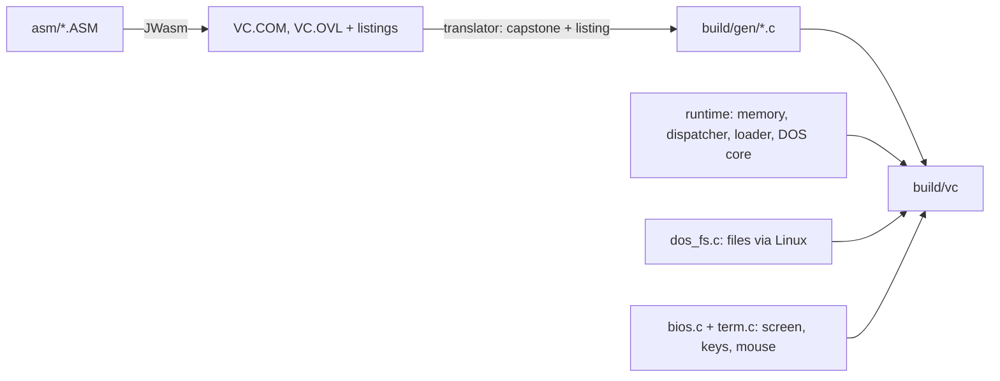

# Volkov Commander on Linux, translated from its own assembly

**Type:** Decision doc
**Status:** building
**Date:** 2026-09-30

## Goal

Run Volkov Commander 4.99.09 as a native Linux program in a terminal. It should work on real
Linux files and look and behave exactly like the DOS original. No emulator runs at run time.

## Decision so far

Translate the original 8086 assembly into C by machine. Reimplement the DOS and BIOS services it
calls in C on top of Linux. Eugene picked translation over an emulator on 2026-09-30 ("I just don't
want the emulator. I want to see something cooler").

Options considered in the chat, with Eugene:

| Option | Strongest objection | Fails when |
|---|---|---|
| Run VC.COM in dosemu2 / DOSBox-X / js-dos | It is still DOS inside: a fake drive, no real Linux files | You want to manage real files |
| Emulate the 8086 plus a DOS layer (kvikdos style) | An interpreter runs at run time, which Eugene ruled out | The goal is "no emulator" |
| Hand rewrite in C with ncurses | A new program, drifts from the original; far2l and mc exist | Fidelity to VC matters |
| **Machine translation to C, DOS layer in C** (chosen) | Large: about 39,000 instructions and 90 DOS/BIOS functions | A translator bug hides in rarely run code |

What would change the ranking: if the translation cannot be made exact, a hand rewrite that uses the
translation as its reference becomes the better path.

## Spike result (2026-09-30)

`PutTime` and `BinDec` from `VCSUBS.INC` were translated two ways, instruction by instruction and as
plain C. Both matched the original machine code, run in unicorn, on all 131,072 inputs. A planted
midnight bug went red on the first input.

## Facts that shaped the design

- The sources are BSD-2 since May 2026. `asm/` holds the 4.99.09 tree from the `build` branch of
  github.com/ddanila/vc, which carries small compile fixes.
- JWasm assembles both programs on Linux. `VC.COM` (tiny model, 9,215 bytes) is byte-identical to
  the TASM build. `VC.OVL` (medium model MZ, 111,624 bytes, 1,491 relocations) assembles too.
- The vendored JWasm listing writer overflows a buffer under FORTIFY, so `tools/jwasm/jwasm` is
  built from the same commit without it.
- VC is two programs. `VC.COM` stays resident. It runs `VC.OVL` with DOS EXEC. `VC.OVL` hands
  back a far pointer to its `Init`, splits its own MCB so it stays in memory, and exits. `VC.COM`
  then calls `Init`. To run a user command, `VC.OVL` jumps back into `VC.COM`, which runs
  `COMMAND.COM /C` and calls `Init` again with the saved state.
- `VC.COM` copies some of its own routines to a new offset at run time and calls the copies.
- `VC.OVL` pops its own return address (`Init`), switches stacks, and edits MCB headers directly.
- The code is plain 8086. It has 7 indirect jumps, no self-modifying instructions and 7 port I/O
  instructions. It hooks INT 1Bh, 22h, 23h, 24h and 27h, and INT 21h in the TSR manager.
- File calls go through one wrapper in `VCCOMMON.INC`. It tries the 71xxh long-name call first and
  falls back to the classic call.

## Design

1. **Keep the machine state faithful.** Registers, flags, a 1 MB memory array, a real 8086 stack,
   a real interrupt vector table, a real MCB chain, real PSPs. VC's tricks then work unchanged.
2. **Translate instructions, never execute bytes.** The translator reads instruction boundaries from
   the JWasm listing, decodes the linked bytes with capstone, and emits C with exact 386 real-mode
   semantics, flags included. Direct jumps become `goto`. Anything dynamic (RET, indirect or far
   transfer, INT) sets CS:IP and returns to one dispatcher loop.
3. **Key code by linear address.** The dispatcher maps CS:IP to an image and an offset. Code that
   VC copied elsewhere is found by matching its bytes against the original image.
4. **Default interrupt handlers are C.** Each vector starts out pointing at a stub address. When the
   dispatcher reaches a stub it calls the C handler, then returns like DOS does (RETF 2). A vector
   VC hooks points at VC's own translated code, so hooks work.
5. **DOS EXEC of `VC.OVL`** loads the translated overlay image. EXEC of anything else runs the
   command through `/bin/sh -c` with the terminal handed back.
6. **Files.** Drive `C:` is `/`. Long names come through the 71xxh functions. Linux names are
   converted from UTF-8 to code page 866 for display and back when opened.
7. **Screen.** The text buffer at B800:0000 is drawn to the terminal with ANSI escapes, only
   changed cells, whenever VC waits for input.

## Gates

- Listing bytes equal linked image bytes for every instruction, and capstone's length equals the
  listing's length. The translator refuses to emit otherwise.
- Every distinct instruction in both images is run in unicorn and in its translated C from random
  states. Registers, defined flags, memory writes and the next CS:IP must match.
- DOS file-layer unit tests against a temporary directory.
- Terminal layer unit tests: key sequences to BIOS codes, screen buffer to escape output.
- End to end: VC starts in a pty on a fixture directory and the rendered panels match.

## Known gaps, accepted for the first build

- Ctrl-O shows VC's saved copy of the screen. It will not show the output of shell commands, which
  go to the terminal's normal screen.
- Holding Shift, Ctrl or Alt only changes the key bar on terminals with the kitty keyboard protocol.
- EMS, XMS and swap-to-disk modes stay off. VC runs in its base-memory mode.

## Outcome (2026-09-30)

VC runs natively. `build/vc` boots VC.COM, which runs VC.OVL as a child exactly as on DOS. The
panels show real Linux files with long and Cyrillic names. View, copy, rename, make directory,
delete, the mouse and shell commands all work, and each is checked on disk by
`tests/test_e2e.py`.

The translator, the DOS file layer and the terminal layer were written by three parallel codex
workers from `docs/briefs/01-03`. The runtime core and the integration were written by Claude.

What the first runs taught us, each now a test or a fix:

- The CPU runs VC.COM's `RESIDENT` banner as code. The translator decodes entry bytes the listing
  calls data.
- VC.COM copies its resident routines elsewhere and reuses its old area for VC.OVL. The dispatcher
  keeps reference bytes per image and matches copies by a known offset.
- Set date, set time and classic free space report errors with AL=FFh or AX=FFFFh, never CF.
  The CF version made VC detect DESQview.
- Classic free space on a large volume returned sectors per cluster FFFFh, which reads as
  "invalid drive". It is now capped at 64, as on DOS 7.
- VC's zooming boxes wait one BIOS tick per frame. The tick counter now updates every 16
  dispatches, and the Copy dialog went from over 1.5 s to 0.16 s.
- VC uppercases 8.3 target names when "Lowercase short names" is on, and the long-name find must
  leave the short name empty when the long name is already 8.3. Both are needed so that
  `hello.txt` stays lowercase.
- The fixture VC.INI from ddanila/vc fails VC's own checksum. `data/VC.INI` is now written by VC.
- VC 4.99.09's internal editor is disabled in its source. F4 goes to `$EDITOR` through VCEDIT.EXT.
- Terminal input can deliver a whole click, or a pasted command, faster than VC polls. Keys wait
  for room in the BIOS ring, and a click lasts at least 80 ms.

Known gaps: Ctrl-O shows VC's saved screen, not shell output. The screen is fixed at 80x25.
Holding modifiers only updates the key bar on kitty-protocol terminals.

## Review (2026-09-30 to 10-01)

One discovery review and two focused verification reviews ran, all read-only codex. That is the
whole budget. The discovery review found 14 defects (3 blockers). Verification 1 found 6 new ones
in the fixes, and verification 2 found 3 more. Every finding was reproduced by a test that fails
on the old code, and then fixed. The ones that could lose data or run code:

- F4 pasted file names into a shell command, so `$(...)` in a name ran. Now `vc-edit` hands the
  resolved file to `$EDITOR` as one argument, on both command paths (COMSPEC /C and INT 2Eh).
  The shipped `VC.EXT` is empty, and old unsafe defaults are replaced.
- F8 on a directory symlink walked into the target. rmdir, and delete of any symlink, now
  remove the link itself.
- Names DOS cannot spell collapsed together, so a delete could hit a neighbour. That covers
  characters outside CP866, the characters DOS forbids (`\ / : * ? " < > |`) and trailing spaces
  or dots. Such a name now carries a suffix from a hash of its own name, never its position. A
  clash is refused, and a spelling shared with a native name is refused unless it is exact.
- A command at DOS's 126-byte limit may have been cut by VC, so it is refused.
- A symlink to an ancestor directory is listed as a file, so the tree scan cannot loop.

Two performance bugs turned up along the way. An empty keyboard poll slept 10 ms, which made the
tree scan 76 times slower. Every path lookup also listed its whole directory.

## Questions for Eugene

1. **Drives.** Answer (2026-10-01): add `H:` for the home directory. `C:` stays `/`.
2. **Date and time format.** Answer: `DD.MM.YY`, 24-hour.
3. **Code page.** Answer: 866.
4. **Publishing.** Answer: a public repo, github.com/evoleinik/vc-linux.

## Decision — 2026-10-01

Translation stays the approach, and it shipped. Defaults follow the answers above.
